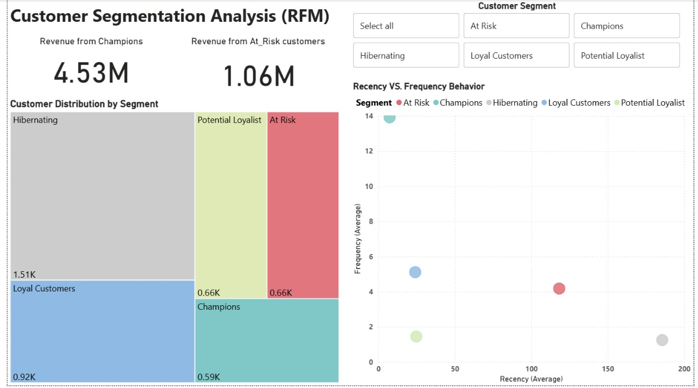

# Customer Segmentation Analysis (RFM)

## Project Overview
This project analyzes customer purchasing behavior using Recency, Frequency, and Monetary (RFM) analysis to segment customers into meaningful groups. The goal is to understand customer value and engagement patterns to support targeted marketing and retention strategies.

---

## Tech Stack
- **Python (Pandas)**
- **Power BI**
- **Jupyter Notebook**
- **Data Source:** Online Retail Dataset (<a href="https://archive.ics.uci.edu/dataset/352/online+retail">UCI</a>)

---

## Dashboard Overview

---

## Key Analysis & Insights
- Calculated Recency, Frequency, and Monetary metrics for each customer  
- Converted raw RFM values into standardized scores for easier comparison  
- Segmented customers into business-relevant groups such as Champions, Loyal Customers, At-Risk, and Hibernating  
- Analyzed behavioral differences across customer segments  

---

## Customer Segmentation
Customers were grouped into the following segments based on RFM scores:
- **Champions:** Highly active and high-value customers  
- **Loyal Customers:** Frequent and consistent buyers  
- **Potential Loyalists:** Recent customers with growth potential  
- **At-Risk Customers:** Previously active customers with declining engagement  
- **Hibernating Customers:** Low-activity and low-value customers  

---

## Business Insights
- A small group of high-value customers contributes a significant portion of total revenue  
- At-risk customers represent an opportunity for targeted retention campaigns  
- Segmentation enables focused marketing strategies instead of uniform outreach  

---

## Outcome
This project demonstrates how RFM-based customer segmentation can help businesses better understand customer behavior, prioritize engagement efforts, and make data-driven marketing decisions.

